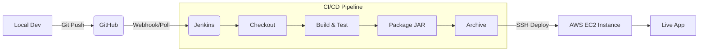

# DevOps Mastery: End-to-End CI/CD Pipeline 🚀


A comprehensive DevOps project demonstrating a complete automation workflow—from local development to cloud deployment. This repository serves as a professional-grade template for building, testing, and deploying Java applications using industry-standard tools.

---

## 🏗️ Project Architecture

The pipeline follows a modern DevOps lifecycle:

1.  **Code**: Java application development with Maven.
2.  **Commit**: Version control via Git & GitHub.
3.  **Build**: Automated compilation and unit testing using Jenkins.
4.  **Package**: Artifact generation (JAR) and archiving.
5.  **Deploy**: Secure automated deployment to an AWS EC2 instance via SSH.



---

## 🛠️ Tech Stack

-   **Language:** Java 21 (LTS)
-   **Build Tool:** Apache Maven 3.x
-   **Testing:** JUnit 5
-   **CI/CD:** Jenkins (Pipeline-as-Code)
-   **Cloud:** AWS EC2 (Amazon Linux 2023 / Ubuntu)
-   **VCS:** Git & GitHub

---

## 📁 Project Structure

```text
.
├── src/
│   ├── main/java/com/devops/app/     # Core Application Logic
│   └── test/java/com/devops/app/     # JUnit 5 Test Suites
├── Jenkinsfile                       # CI/CD Pipeline Definition (Groovy)
├── pom.xml                           # Maven Project Configuration
├── guide_part1_git_basics.md        # Step-by-step Git Tutorial
├── guide_part2_java_app_and_jenkins.md # CI/CD Setup Guide
├── guide_part3_aws_deployment.md    # Cloud Infrastructure Guide
├── guide_part4_final_summary.md     # Project Wrap-up & Best Practices
└── README.md                         # Project Documentation
```

---

## 🚀 Getting Started

### 1. Prerequisites
-   **JDK 21** installed and `JAVA_HOME` configured.
-   **Maven 3.x** installed and added to `PATH`.
-   **Git** configured locally.
-   **Jenkins** installed (Local or Server).
-   **AWS Account** for EC2 deployment.

### 2. Local Build & Run
Test the application on your machine before pushing to the pipeline:

```bash
# Clone the repository
git clone https://github.com/chala2001/devops-project.git
cd devops-project

# Build and run tests
mvn clean test

# Package the application
mvn package

# Run the application
java -jar target/hello-devops-1.0-SNAPSHOT.jar
```

---

## ⚙️ CI/CD Pipeline Configuration

The `Jenkinsfile` defines a 5-stage declarative pipeline:

| Stage | Description | Command |
| :--- | :--- | :--- |
| **Checkout** | Pulls the latest code from GitHub | `checkout scm` |
| **Build** | Compiles source code | `mvn clean compile` |
| **Test** | Runs unit tests and records results | `mvn test` |
| **Package** | Creates the executable JAR | `mvn package` |
| **Deploy** | Transfers JAR to AWS and executes | `sshPublisher` |

### Setup Jenkins:
1.  Install **Pipeline**, **Git**, and **SSH Publisher** plugins.
2.  Configure **Global Tool Configuration** for JDK 21 and Maven.
3.  Add **SSH Credentials** for your AWS EC2 instance.
4.  Create a **Pipeline Job** pointing to this repository.

---

## ☁️ AWS Deployment

The application is deployed to an **AWS EC2 Instance**. 

### Deployment Steps:
1.  **Launch EC2:** Use Amazon Linux 2023 or Ubuntu (Free Tier).
2.  **Security Group:** Allow SSH (Port 22) from your Jenkins server/local IP.
3.  **Key Pair:** Save your `.pem` file and add it to Jenkins credentials.
4.  **Auto-Run:** The pipeline automatically:
    -   Connects via SSH.
    -   Creates the `/home/ec2-user/app` directory.
    -   Copies the latest JAR.
    -   Restarts the application.

---

## 📚 Learning Path

This project includes a detailed 4-part guide to help you master these concepts:

-   📖 **[Part 1: Git Foundations](guide_part1_git_basics.md)** - Branching, commits, and GitHub workflows.
-   📖 **[Part 2: CI/CD with Jenkins](guide_part2_java_app_and_jenkins.md)** - Automation, Pipelines, and Maven.
-   📖 **[Part 3: Cloud & AWS](guide_part3_aws_deployment.md)** - EC2 setup and automated deployment.
-   📖 **[Part 4: Final Summary](guide_part4_final_summary.md)** - Monitoring and pipeline optimization.

---

## 🤝 Contributing
Contributions are welcome! If you have suggestions for improving the pipeline or adding new features (like Dockerization or Kubernetes), feel free to open an issue or submit a pull request.

---

## 📄 License
Distributed under the MIT License. See `LICENSE` for more information.

---
**Created by [Chalaka](https://github.com/chala2001) - 2026**
